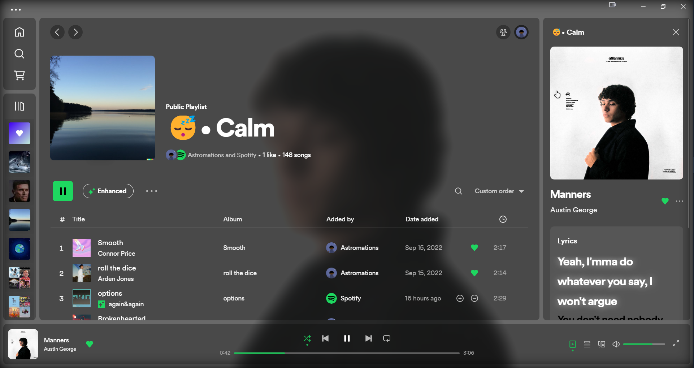

# Translucent theme for [Spicetify](https://github.com/khanhas/spicetify-cli)

This is a tweaked version of the Default theme.
The main differences are the light/dark toggle, the background cover and the dynamic highlight color, ie. it will match the current album art.

## Preview




## Install / Update

Make sure you are using latest releases of Spicetify and Spotify

### Windows (PowerShell)

```powershell
Invoke-WebRequest -UseBasicParsing "https://raw.githubusercontent.com/JulienMaille/spicetify-dynamic-theme/master/install.ps1" | Invoke-Expression
```

### Linux/MacOS (Bash)

```bash
curl -fsSL https://raw.githubusercontent.com/JulienMaille/spicetify-dynamic-theme/master/install.sh | sh
```

### Manual Install

1. Download the latest [Source code (zip)](https://github.com/JulienMaille/spicetify-dynamic-theme/releases/latest)
2. Extract the files to your [Spicetify/Themes folder](https://spicetify.app/docs/development/customization#themes) (rename the zipped folder to `DefaultDynamic`)
3. Copy `default-dynamic.js` to your [Spicetify/Extensions folder](https://spicetify.app/docs/advanced-usage/extensions#installing)
4. Add the 2 lines in `[Patch]` section of the config file (see details below)
5. Run:
    ```
    spicetify config extensions default-dynamic.js extensions Vibrant.min.js
    spicetify config current_theme DefaultDynamic
    spicetify config color_scheme base
    spicetify config inject_css 1 replace_colors 1
    spicetify apply
    ```

### Manual Uninstall

1. Remove Patch lines you added in config file earlier.
2. Run:
    ```
    spicetify config current_theme " " color_scheme " " extensions default-dynamic.js- extensions Vibrant.min.js-
    spicetify apply
    ```
