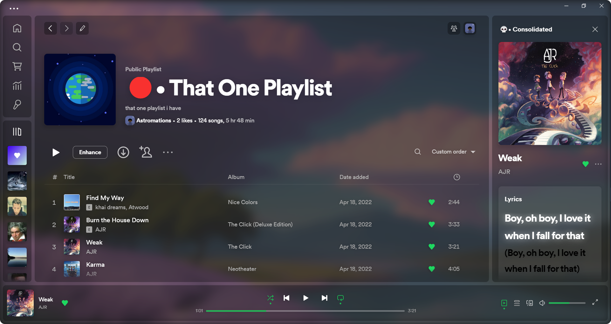
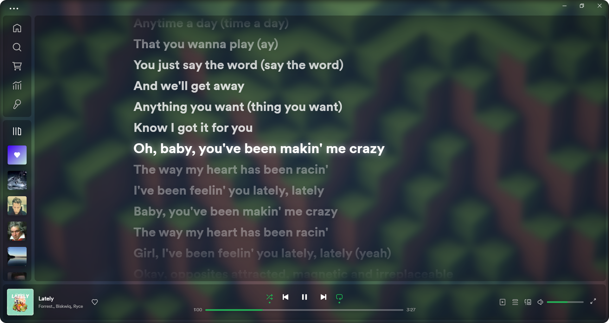
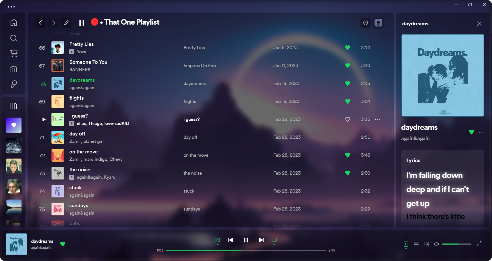

# Hazy 

A translucent theme based on <a href="https://github.com/JulienMaille/spicetify-dynamic-theme">DynamicDefault</a> and <a href="https://github.com/nimsandu/spicetify-bloom">Bloom</a>. If you're liking Hazy, please don't forget to ⭐ the project.


## Preview
**Custom Backgrounds**





**Set Background To Album Art**  


  
### ⏹️ How To Get Sidebar ⏹️
---
1. Click on your Profile > Experimental Features
2. Search"sidebar" 
3. Copy the following settings:
  <div>
     
  </div>
  
 <span>**Click the new "Now Playing View" button to activate the sidebar**</span>
  
<span>
  
 </span>

    
### ⬇️ Automatic Installation ⬇️

---

Windows -> **PowerShell**:

```powershell
iwr -useb https://raw.githubusercontent.com/Astromations/Hazy/main/install.ps1 | iex
```

macOS and Linux -> **Bash**:

```bash
curl -fsSL https://raw.githubusercontent.com/Astromations/Hazy/main/install.sh | sh
```    
    
### 📃 Manual Installation 📃

---

Download the repo and put `user.css`, `theme.js` and `color.ini` into a new folder named `Hazy`, and place this folder into your `Themes` folder in `.spicetify`.
Then run these commands to apply:
    
```powershell
spicetify config current_theme Hazy
spicetify config inject_css 1 replace_colors 1 overwrite_assets 1 inject_theme_js 1
spicetify apply
```


